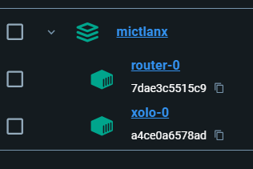
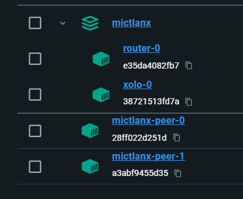

# MictlanX - Basics

## Requirements
- Python 3.8+
- Poetry (pip3 install poetry)
- Docker 

## Getting started
1. Deploy a MictlanX Storage System executing the bash script ```run_mictlanx.sh``` this is gonna create a network called ```mictlanx```, 1 router and 1 xolo summoner. 

```sh
./run_mictlanx.sh
```

after this command you're gonna see in your Docker Deskptop something like this:

<p align=center>

<p/>


2. Now deploy 2 storage peers using this script:

```sh
./add_peers.sh
```
<p align=center>

<p/>

3. Finally executes the examples: 

```sh
poetry shell
poetry install
python3 ./mictlanxbasics/main.py
```

It is super important to run the examples from the main folder of the project :) 

### Log records

The default folder for logs is ```./log``` please check them out must be two log files in that folder, one of them is the info  ```client-0``` and the second captures the errors ```client-0.error```. 

```json
[
    {
    "timestamp": "2024-06-17 12:55:01,458",
    "level": "INFO",
    "logger_name": "client-0",
    "thread_name": "MainThread",
    "event": "PUT.CHUNKED",
    "bucket_id": "moringas",
    "key": "5dcea5995aad5acaa917cdd5fee5d7fe2a7a8d999f7406d9ee02ee446ca7c801",
    "size": 233832,
    "response_time": 0.011284589767456055,
    "peer_id": "mictlanx-peer-0"
}

{
    "timestamp": "2024-06-17 12:55:01,497",
    "level": "INFO",
    "logger_name": "client-0",
    "thread_name": "MainThread",
    "event": "PUT.CHUNKED",
    "bucket_id": "moringas",
    "key": "b74282be58ac89cc701827462723e2e9e161e3527efdfc9ce02b61d7fd8fd1e4",
    "size": 63090,
    "response_time": 0.006818532943725586,
    "peer_id": "mictlanx-peer-1"
}

{
    "timestamp": "2024-06-17 12:55:15,816",
    "level": "INFO",
    "logger_name": "client-0",
    "thread_name": "MainThread",
    "event": "PUT.CHUNKED",
    "bucket_id": "moringas",
    "key": "0c18a430386eac26eb1797c6d2a6e69e1046d2b49e0b19bb186d0dde7b6b5503",
    "size": 372790,
    "response_time": 0.006620645523071289,
    "peer_id": "mictlanx-peer-0"
}


]
```


## Consume the data

If you run the examples with the default config youre gonna be able to hit the next links to see your data from the browsers: 

- [Data 1](http://localhost:60666/api/v4/buckets/moringas/5dcea5995aad5acaa917cdd5fee5d7fe2a7a8d999f7406d9ee02ee446ca7c801)
- [Data 2](http://localhost:60666/api/v4/buckets/moringas/b74282be58ac89cc701827462723e2e9e161e3527efdfc9ce02b61d7fd8fd1e4)
- [Data 3](http://localhost:60666/api/v4/buckets/moringas/0c18a430386eac26eb1797c6d2a6e69e1046d2b49e0b19bb186d0dde7b6b5503)


If you wanna something more complex or you wanna consume from another application you need the client:

```py
MICTLANX_CLIENT_ID         = os.environ.get("MICTLANX_CLIENT_ID","client-0")
MICTLANX_DEFAULT_BUCKET_ID = os.environ.get("MICTLANX_DEFAULT_BUCKET_ID","moringas")
MICTLANX_DEBUG             = bool(int(os.environ.get("MICTLANX_DEBUG","1")))
MICTLANX_MAX_WORKERS       = int(os.environ.get("MICTLANX_MAX_WORKERS","2"))
MICTLANX_LOG_PATH          = os.environ.get("MICTLANX_LOG_PATH","./log")
SOURCE_PATH                = os.environ.get("SOURCE_PATH","./source")
routers = list(UtilsX.routers_from_str(os.environ.get("MICTLANX_ROUTERS","mictlanx-router-0:localhost:60666")))

client = Client(
    client_id      = MICTLANX_CLIENT_ID,
    routers         = routers,
    debug           = MICTLANX_DEBUG,
    max_workers     = MICTLANX_MAX_WORKERS,
    bucket_id       = MICTLANX_DEFAULT_BUCKET_ID,
    log_output_path = MICTLANX_LOG_PATH    
)

client.get_with_retry(
    bucket_id = "moringas",
    key ="0c18a430386eac26eb1797c6d2a6e69e1046d2b49e0b19bb186d0dde7b6b5503"
)
# Result[GetBytesResponse,Exception]
```